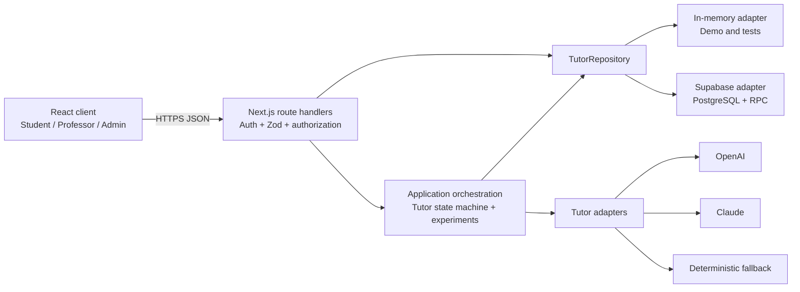
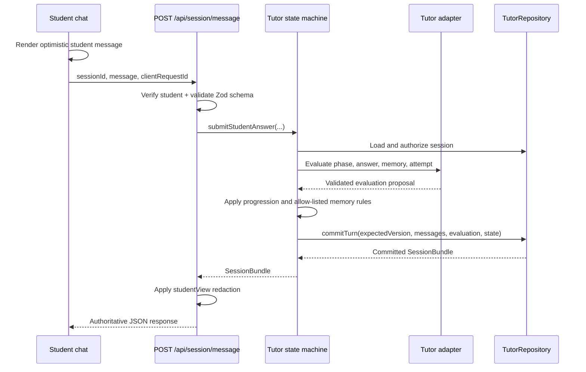

# System Architecture

This document is the technical map of Socratic Digital Twin AI Tutor. It explains where each responsibility lives, how the frontend and backend communicate, and which boundaries must remain intact when the system is extended.

For local setup and day-to-day development, see [Developer Guide](DEVELOPER_GUIDE.md). For the expected contribution workflow, see [Contributing](../CONTRIBUTING.md).

## 1. Architectural goals

The POC is designed around five goals:

1. **Run anywhere:** the full workflow remains demonstrable without external credentials.
2. **Keep trust on the server:** browsers never receive database service keys or AI provider keys.
3. **Make state changes deterministic:** the tutor may propose an evaluation, but application code controls progression and persistence.
4. **Preserve teaching history:** published case versions and frozen evaluation evidence are immutable, and review history is retained with its owner.
5. **Fail safely:** unavailable or invalid AI output falls back to deterministic teaching behavior instead of producing a partial database write.

## 2. System context

The dependency direction is deliberate: UI code depends on HTTP contracts, route handlers depend on application services and interfaces, and infrastructure adapters implement those interfaces. Database and provider SDKs must not leak into client components.

## 3. Frontend

### 3.1 Frontend responsibilities

The frontend is responsible for:

- rendering role-specific workflows;
- managing local interaction state, loading states, and optimistic student messages;
- calling same-origin `/api/**` endpoints;
- presenting only data returned by the server for the active role;
- browser-only capabilities such as speech recognition and audio playback.

The frontend must not decide authorization, phase progression, scores, review ownership, or whether a case is editable. Those are backend rules.

### 3.2 Page map

| User journey | Route | Main implementation |
| --- | --- | --- |
| Student case selection | `/` | `app/page.tsx` |
| Student tutoring session | `/session/[id]` | `app/session/[id]/page.tsx`, `app/session/[id]/socratic-chat.tsx` |
| Student learning summary | `/session/[id]/summary` | `app/session/[id]/summary/page.tsx`, `app/session/[id]/summary/summary-view.tsx` |
| Professor workspace | `/professor` | `app/professor/page.tsx`, `app/professor/professor.module.css` |
| Professor session review | `/professor/review/[id]` | `app/professor/review/[id]/page.tsx`, `professor-review.tsx`, `review.module.css` |
| Faculty release approval | Professor workspace section | `app/professor/faculty-release-approval.tsx` |
| Admin workspace | `/admin` | `app/admin/page.tsx` |
| Tutor improvement workflow | Admin workspace section | `app/admin/feedback-lab.tsx` |

Dynamic page components follow the Next.js 15 asynchronous `params` convention. The server wrapper awaits `params` and passes the identifier into the interactive client component.

### 3.3 Shared UI

| Path | Responsibility |
| --- | --- |
| `app/layout.tsx` | Root metadata, global header, page shell |
| `app/globals.css` | Shared design tokens and global component styles |
| `components/site-header.tsx` | Seeded identity selector and role-aware navigation |
| `components/case-resources.tsx` | Synthetic, presentation-only image/audio/video demo resources; these are not persisted clinical media |
| `components/date-time-select.tsx` | Accessible date and time selection used by assignment forms |
| `components/date-time-select.module.css` | Styles scoped to the date-time selector |

### 3.4 Frontend data pattern

Interactive pages use this pattern:

1. Start with an explicit `loading` state.
2. Fetch a same-origin API route inside the client component.
3. Check `response.ok` before consuming the result.
4. Show a user-readable error without exposing server internals.
5. Track the exact pending action so the clicked button shows progress and duplicate actions are disabled.
6. Refresh or replace local data only after the server confirms the mutation.

The student chat adds an optimistic student message before evaluation returns. The optimistic message is presentation state only; the server remains the source of truth and the client replaces it with the committed session bundle.

## 4. Backend

### 4.1 Backend responsibilities

The backend is responsible for:

- verifying the signed demo identity cookie;
- enforcing role and resource-level authorization;
- validating request bodies and AI output with Zod;
- applying case, assignment, session, and review business rules;
- selecting persistence and AI adapters;
- committing state atomically and resolving concurrency conflicts;
- redacting role-sensitive response fields;
- logging provider failures without student text or secrets.

### 4.2 HTTP boundary

Route handlers live under `app/api/`. They should remain thin: authenticate, parse, call one application/repository operation, shape the response, and translate errors.

| Route group | Location | Responsibility |
| --- | --- | --- |
| Demo identity | `app/api/demo/identity/route.ts` | List allowed users and set the signed HttpOnly cookie |
| Student offerings | `app/api/cases/route.ts` | Return class-scoped case assignments |
| Session lifecycle | `app/api/session/**/route.ts` | Start, read, pause, resume, complete, and submit answers |
| Tutor speech | `app/api/session/speech/route.ts` | Authorize a Tutor message and return generated MP3 audio |
| Professor operations | `app/api/professor/**/route.ts` | Classes, assignments, session queue, reviews, approvals |
| Admin operations | `app/api/admin/**/route.ts` | Users, classes, case versions, activity, review assignment |
| Tutor improvement | `app/api/admin/humanization/**/route.ts` | Frozen datasets, candidates, evaluations, experiments, releases |

Shared HTTP behavior is in `lib/http.ts`:

- `errorResponse()` maps domain/authentication errors to JSON status codes.
- `studentView()` removes classifications, reasoning gaps, private weaknesses, and unfinished professor review data from student responses.

### 4.3 Authentication and authorization

`lib/auth.ts` signs and verifies the `demo_session` cookie using HMAC-SHA256. `POST /api/demo/identity` accepts a seeded `userId`; the server resolves the role rather than trusting a client-supplied role.

Every protected route must use one of:

- `requireStudent()`
- `requireProfessor()`
- `requireAdmin()`

A role check is necessary but not sufficient. The called repository or service operation must also verify ownership or class membership. For example, a professor cannot read a session merely because the professor role is present; the session must belong to a class taught by that professor.

### 4.4 Domain and validation boundary

| Path | Responsibility |
| --- | --- |
| `lib/domain.ts` | Framework-independent domain types, classifications, and score calculation |
| `lib/schemas.ts` | Runtime Zod schemas for HTTP input and structured AI output |
| `lib/auth.ts` | Signed identity and role guards |
| `lib/http.ts` | Error mapping and role-specific response shaping |
| `lib/idempotency.ts` | Duplicate in-process request protection |
| `lib/presentation.ts` | Shared presentation-safe formatting helpers |
| `lib/seed.ts` | Deterministic demo identities, classes, cases, and assignments |

TypeScript types support development, but they do not validate runtime data. JSON request payloads and model output must cross a Zod schema before use; path parameters must be treated as untrusted identifiers and authorized against the loaded resource.

### 4.5 Repository boundary

`lib/repository/types.ts` defines `TutorRepository`, the persistence contract used by routes and services.

Implementations:

- `lib/repository/memory.ts`: in-process storage seeded from `lib/seed.ts`; used for credential-free demos and tests.
- `lib/repository/supabase.ts`: server-only Supabase implementation.
- `lib/repository/index.ts`: singleton adapter selection.
- `lib/repository/case-version.ts`: helpers for immutable case lineage and version slugs.

Selection rules:

1. `FORCE_MEMORY_REPOSITORY=true` selects memory storage.
2. Otherwise, both `SUPABASE_URL` and `SUPABASE_SERVICE_ROLE_KEY` select Supabase.
3. If the pair is incomplete, memory storage is selected.

New persistence behavior must be added to the interface and both adapters. Contract-level behavior should be tested against the memory implementation, and Supabase-specific constraints should be expressed in a new migration.

### 4.6 Tutor engine and state machine

| Path | Responsibility |
| --- | --- |
| `lib/tutor/state-machine.ts` | Authoritative answer-processing workflow and phase progression |
| `lib/tutor/index.ts` | Provider selection and deterministic request-level fallback |
| `lib/tutor/openai.ts` | OpenAI structured-output adapter |
| `lib/tutor/claude.ts` | Claude structured-output adapter |
| `lib/tutor/deterministic.ts` | Credential-free teaching rules |
| `lib/tutor/prompt.ts` | Versioned shared Tutor behavior contract |
| `lib/tutor/summary-ai.ts` | Provider-backed summary selection and fallback |
| `lib/tutor/summary.ts` | Deterministic summary template |
| `lib/tutor/speech.ts` | Server-side OpenAI text-to-speech adapter |

Selection uses OpenAI when its complete key/model pair exists; otherwise it uses Claude when that pair exists; otherwise it uses deterministic rules. A configured network provider that times out, refuses, or returns invalid output falls directly to deterministic behavior for that request. It does not silently switch to the other network provider. Provider errors are logged using provider, request ID, and error type only.

The model is not allowed to mutate application state. It returns a validated proposal containing a classification, confidence, observable reasoning gap, strategy, feedback, one follow-up question, and an allow-listed memory patch. `state-machine.ts` decides phase completion, updates learner state, calculates metadata, and passes one atomic commit to the repository.

### 4.7 Answer submission sequence

`clientRequestId` protects duplicate submissions in the running process. `expectedVersion` protects the learner state from stale concurrent writes. In Supabase mode, `commit_tutor_turn` writes the student message, evaluation, Tutor reply, session state, and session metadata atomically.

## 5. Data layer

### 5.1 Core teaching data

- Identity and organization: `users`, `classes`, `class_memberships`
- Content and scheduling: `cases`, `case_phases`, `class_case_assignments`
- Learning record: `sessions`, `messages`, `evaluations`, `session_state`
- Faculty review: `answer_reviews`, `tutor_turn_reviews`, `session_reviews`

### 5.2 Tutor improvement data

- Evidence: `humanization_datasets`, `humanization_dataset_entries`
- Candidate evaluation: `tutor_candidates`, `humanization_eval_runs`
- Controlled rollout: `humanization_experiments`, `humanization_experiment_assignments`, `humanization_shadow_results`
- Governance: `faculty_release_approvals`, `tutor_releases`, `tutor_release_events`

The implementation is under `lib/experiments/`. `store.ts` provides memory and Supabase stores; `privacy.ts` and `dataset.ts` build de-identified, content-addressed evidence; `candidate-runner.ts`, `core.ts`, and `rollout.ts` evaluate and gate candidates; `shadow.ts` integrates controlled experiments into a Tutor turn.

This is an offline, governed feedback loop. A professor comment never directly rewrites the active prompt, model weights, learner memory, or phase state.

### 5.3 Migrations and security

Database history lives in `supabase/migrations/`; deterministic fixtures live in `supabase/seed.sql`; generated database types live in `lib/database.types.ts`.

Engineering rules:

- Never rewrite a migration that may already be applied.
- Create a new forward migration for every schema or constraint change.
- Enable RLS on every public table.
- Keep `service_role` server-only and revoke direct browser roles unless a reviewed browser policy is intentionally introduced.
- Put invariants in database constraints as well as application validation.
- Use transactions or RPCs for multi-row state changes.

## 6. Key business invariants

- A case draft has exactly five complete phases.
- Published cases are immutable; editing requires a cloned draft version.
- Professors assign only published cases to classes they teach.
- Each student has at most one session per class assignment.
- Closed or expired assignments cannot start a new session, but an existing session may continue.
- A paused session rejects new answers until it is resumed.
- `correct` advances a phase; the third unsuccessful attempt also advances to prevent a dead end.
- Only completed sessions can be reviewed.
- The first professor to save a draft review claims it; competing writes return a conflict.
- The UI treats completed reviews as final, and Admins can reassign only unfinished reviews. See the explicit POC caveat below about same-reviewer API resubmission.
- AI and professor scores remain separate.

## 7. Engineering principles

### Separation of concerns

UI components render and collect input. Route handlers own the HTTP boundary. Application orchestration coordinates workflows. Repositories own persistence. Provider adapters own external SDK calls.

### Dependency inversion

Business workflows depend on `TutorRepository`, not Supabase. Tutor orchestration depends on a shared evaluation result, not a provider-specific response type.

### Single source of truth

The committed `SessionBundle` is authoritative. Client optimism improves responsiveness but does not replace server state. Published content and frozen evaluation datasets preserve history.

### Defense in depth

Role guards, resource checks, Zod validation, database constraints, RLS, and server-only secrets reinforce one another. No single layer is treated as sufficient.

### Deterministic degradation

Memory persistence and deterministic tutoring keep the POC usable without services. AI failures fail over at a request boundary; they do not create half-written turns.

### Explicit concurrency control

Idempotency keys handle retries, state versions reject stale Tutor turns, unique constraints prevent duplicate sessions, and review claims use conflict semantics.

### Privacy by design

The POC uses synthetic cases only. Student answers are untrusted data, model output excludes hidden chain-of-thought, logs are redacted, and Tutor improvement datasets are pseudonymized and frozen before evaluation.

## 8. Where to make a change

| Change | Start here | Also review |
| --- | --- | --- |
| Student case-card UI | `app/page.tsx` | `app/globals.css`, `app/api/cases/route.ts` |
| Session chat interaction | `app/session/[id]/socratic-chat.tsx` | `app/api/session/**`, `lib/tutor/state-machine.ts` |
| Professor dashboard | `app/professor/page.tsx` | `app/api/professor/**`, repository authorization |
| Admin workflow | `app/admin/page.tsx` | `app/api/admin/**`, `lib/schemas.ts` |
| Tutor improvement UI | `app/admin/feedback-lab.tsx` | `app/api/admin/humanization/**`, `lib/experiments/**` |
| New HTTP field | Relevant `route.ts` | `lib/schemas.ts`, `lib/domain.ts`, client caller, tests |
| New persistence operation | `lib/repository/types.ts` | Memory adapter, Supabase adapter, migration, tests |
| Tutor behavior | `lib/tutor/prompt.ts` | Provider adapters, output schema, frozen evaluation workflow |
| Scoring or progression | `lib/domain.ts` or `lib/tutor/state-machine.ts` | Unit tests and professor/student presentation |
| Database schema | New file in `supabase/migrations/` | `lib/database.types.ts`, both repository adapters |
| Speech output | `app/api/session/speech/route.ts` | `lib/tutor/speech.ts`, chat playback UI |
| Authorization | `lib/auth.ts` and route handler | Resource checks, negative API tests |

## 9. Architectural change checklist

Before merging a cross-layer change, verify:

- the frontend contains no provider or service-role secret;
- HTTP and AI input are validated at runtime;
- authorization includes resource ownership, not only role;
- memory and Supabase behavior remain compatible;
- multi-row persistence is atomic;
- retries are idempotent or explicitly conflict;
- student responses do not expose professor-only evaluation fields;
- new schema changes use a forward migration;
- deterministic fallback still works;
- relevant unit, integration, build, and browser checks pass.

## 10. POC boundaries

This repository intentionally does not provide production authentication, real clinical data, clinical diagnosis, formal audit retention, institutional tenancy, or regulatory compliance. Replacing demo identity with an institutional identity provider and completing privacy, security, accessibility, and educational-data reviews are prerequisites for production use.

The current UI locks a completed review and Admin reassignment rejects it, but the repository API does not yet explicitly reject a resubmission by the same claiming Professor. Treat completed-review immutability as an identified hardening item rather than a fully enforced invariant until both repository adapters and a regression test enforce it.

The attachment panel has browser-side synthetic defaults for demonstration; it is not a durable clinical-media store. Persisted media would require an explicit storage model, authorization policy, migration, and repository mapping.
