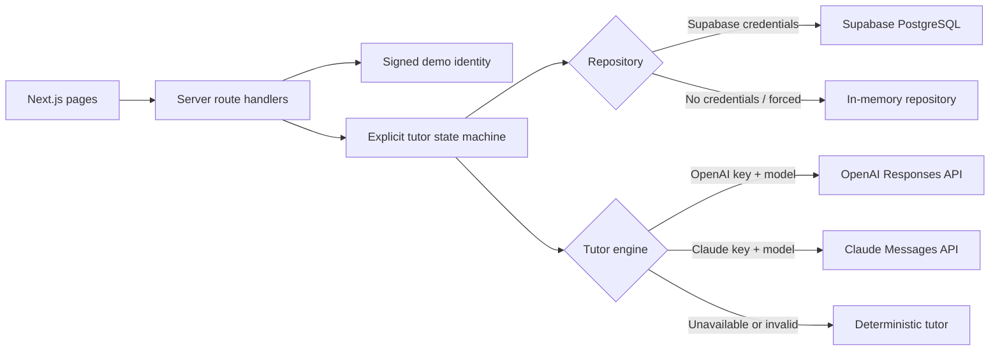

# 开发者指南

本文档面向需要本地运行、调试、扩展或部署 Socratic Digital Twin AI Tutor 的开发者。

## 1. 系统定位

这是一个教学概念验证（POC），用于演示“Admin 组织教学 → Professor 布置病例 → Student 完成苏格拉底式推理 → Professor 复核 → Admin 观察全局状态”的闭环。

它不是临床诊断系统，不包含真实患者数据，也没有正式注册、OAuth 或 Supabase Auth。身份来自预置用户，并通过服务端签名的 HttpOnly Cookie 保存。

## 2. 技术栈与要求

- Next.js 15 App Router、React 19、TypeScript、Tailwind CSS
- Node.js 22 或更高版本
- Zod 共享输入/输出校验
- Supabase PostgreSQL（可选）或进程内存 repository
- OpenAI Responses API（优先，可选）、Claude Messages API（可选）或确定性 tutor
- Vitest、ESLint、TypeScript 和 Next.js production build

## 3. 快速启动

```bash
npm install
copy .env.example .env.local
npm run dev
```

打开 `http://localhost:3000`。完全不配置外部凭证时，应用仍可使用内存数据和确定性 tutor 运行完整演示。

提交代码前执行：

```bash
npm run typecheck
npm test
npm run lint
npm run build
```

## 4. 双适配器架构



数据库与 AI 适配器独立选择。例如，可以使用真实 Supabase 加确定性 tutor，也可以使用内存 repository 加 OpenAI。

选择规则：

1. `FORCE_MEMORY_REPOSITORY=true` 强制内存模式。
2. 否则同时存在 `SUPABASE_URL` 和 `SUPABASE_SERVICE_ROLE_KEY` 时使用 Supabase。
3. `TUTOR_PROVIDER` 必须显式锁定为 `openai`、`claude` 或 `deterministic`。
4. 网络 provider 必须同时配置对应的 key 与 model；不会静默切换到另一个网络 provider。
5. 单次调用失败、超时、拒答或输出不合法时，仅该轮使用确定性 tutor，并记录和向学生提示降级。

## 5. 环境变量

| 变量 | 必需性 | 说明 |
| --- | --- | --- |
| `DEMO_SESSION_SECRET` | 生产必需 | HMAC 签名 Mock 身份 Cookie；使用长随机值 |
| `SUPABASE_URL` | 可选 | Supabase Project URL |
| `SUPABASE_SERVICE_ROLE_KEY` | 可选 | 仅服务端使用；绝不能添加 `NEXT_PUBLIC_` 前缀 |
| `FORCE_MEMORY_REPOSITORY` | 可选 | `true` 时忽略 Supabase 配置 |
| `TUTOR_PROVIDER` | POC 必需 | 锁定 `deterministic`、`openai` 或 `claude` |
| `OPENAI_API_KEY` | 可选 | 仅服务端读取 |
| `OPENAI_MODEL` | 与 OpenAI key 配套 | 账号可用并支持 Structured Outputs 的模型 ID |
| `OPENAI_PROXY_URL` | 可选 | Node.js 访问 OpenAI 的 HTTP(S) 代理 |
| `ANTHROPIC_API_KEY` | 可选 | 仅服务端读取 |
| `CLAUDE_MODEL` | 与 Claude key 配套 | 账号可用并支持 Structured Outputs 的模型 ID |

密钥只放在 `.env.local`、Vercel Environment Variables 或安全的 secret manager 中。不要提交 `.env.local`，不要在客户端组件读取 service-role key 或 AI key。

## 6. 代码结构

| 路径 | 职责 |
| --- | --- |
| `app/page.tsx` | 学生任务入口 |
| `app/session/[id]` | 对话和总结页面 |
| `app/professor` | 教授班级、任务和复核队列 |
| `app/admin` | 用户、班级、病例和 Activity |
| `app/api` | 服务端 API 与资源级权限检查 |
| `components/site-header.tsx` | 预置身份切换 |
| `lib/domain.ts` | 核心领域类型与评分常量 |
| `lib/schemas.ts` | 共享 Zod schema |
| `lib/auth.ts` | Cookie 签名、校验和角色守卫 |
| `lib/repository` | repository 接口、内存实现与 Supabase 实现 |
| `lib/tutor` | OpenAI、Claude、确定性 tutor、总结与状态机 |
| `supabase/migrations` | 版本化数据库 schema |
| `supabase/seed.sql` | 可重复执行的演示数据 |

## 7. 身份与权限

`POST /api/demo/identity` 只接受 `{ "userId": "<预置 UUID>" }`。角色由服务器从 repository 读取，客户端不能自行提交 `role=admin` 来提升权限。

`requireStudent()`、`requireProfessor()` 和 `requireAdmin()` 负责角色校验；API 还必须做资源级检查：

- 学生只能访问自己的会话和当前所属班级的任务。
- 教授只能访问自己任教班级的任务与会话。
- Admin 才能管理用户、班级、病例版本和复核归属。
- 停用用户不能切换身份或继续使用受保护接口。

这是演示身份系统，不应直接改造成生产认证。正式系统应接入机构身份提供商，并把外部身份映射到内部用户和班级权限。

## 8. 教学状态机

学生提交回答后，`lib/tutor/state-machine.ts` 按以下顺序处理：

1. 读取会话并校验所有权与状态。
2. 读取当前阶段和该阶段尝试次数。
3. 把权威病例叙述、附件说明/文字稿、阶段 rubric/guidance、近期对话与有界学习者记忆交给 AI tutor；失败则回退到确定性 tutor。
4. 先按分类应用匹配的脚本化 tutor move，再生成一条学生消息、评价、学习记忆补丁和一个追问；这些隐藏教学内容不能直接作为答案透露给学生。
5. 仅合并白名单字段：错误、强项、弱项、掌握度和下一策略。
6. 使用 `expectedVersion` 做乐观并发控制并原子持久化本轮。
7. 只有满足当前目标的 `correct` 推理才能推进；作答次数不会代替胜任度。
8. 最终阶段先完成反思性追问再生成总结；学生也可以提前结束并生成 `completedAllPhases=false` 的总结。

结论正确但推理错误或缺失时映射为 `partial`，不能推进。学生在同一次回答中明确自我纠正时，以其最终立场进行评价，不把已放弃的前半句当作最终错误。

AI 评分映射为 `correct=100`、`partial=70`、`vague=40`、`wrong=0`，最后取平均并四舍五入。教授最终评分独立保存，不覆盖 AI 原始评价。

## 9. 数据库与 Supabase

主要表包括：

- `users`
- `classes`、`class_memberships`
- `cases`、`case_phases`、`class_case_assignments`
- `sessions`、`messages`、`evaluations`、`session_state`
- `answer_reviews`、`session_reviews`

远程项目初始化：

```bash
npx supabase@latest login
npx supabase@latest link --project-ref YOUR_PROJECT_REF
npx supabase@latest db push
```

然后在 SQL Editor 运行 `supabase/seed.sql`。仅在一次性开发环境中使用：

```bash
npx supabase@latest db push --include-seed
```

不要对含有需要保留数据的远程项目执行 reset 或重复导入破坏性 seed。

所有公开表启用 RLS，且撤销 `anon`/`authenticated` 的直接表权限。浏览器不直接连接数据库；所有查询通过服务端 service-role repository。`commit_tutor_turn` 数据库函数用于原子写入一次教学回合。

## 10. 病例、任务与复核规则

- 病例草稿必须完整包含 1–12 个阶段，并可添加病例专用影像、音频或视频附件。
- 已发布病例不可原地编辑；修改时 Clone 为下一版本草稿。
- 教授只能把已发布病例布置给自己的班级。
- 截止或关闭后不能创建新会话；已开始的会话仍可继续。
- 每名学生对每个班级任务只保留一个会话，重复开始会恢复原会话。
- 只有已完成会话可以被复核。
- 第一位保存草稿的教授原子认领复核；其他教授只读。
- Admin 可以释放或重新指派未完成复核；已完成复核不可覆盖。

## 11. API 约定

完整 API 列表见根目录 `README.md`。关键请求：

```json
POST /api/session/start
{ "assignmentId": "uuid" }
```

```json
POST /api/session/message
{
  "sessionId": "uuid",
  "message": "student reasoning",
  "clientRequestId": "client-generated-id"
}
```

`POST /api/session/:id/pause` 与 `POST /api/session/:id/resume` 采用 Next.js 15 异步路由参数，校验学生所有权后在 session context 中持久化 `pausedAt`。暂停不修改状态机版本；暂停期间拒绝新的回答。

```json
POST /api/professor/review
{
  "sessionId": "uuid",
  "reviews": [{ "evaluationId": "uuid", "label": "partial", "comments": "..." }],
  "overallFeedback": "...",
  "status": "draft"
}
```

公开请求与 AI 输出都必须先通过共享 Zod schema。学生会话响应会剥离 AI 推理缺口、分类和学习弱点；教授视图才返回完整评价。

## 12. 测试策略

```bash
npm run typecheck       # TypeScript
npm test                # Vitest 单元和集成测试
npm run lint            # ESLint
npm run build           # Next.js 生产构建
```

测试重点：

- 四种评价与分数计算
- 三次尝试保护、阶段推进和提前结束
- 记忆补丁白名单
- 身份签名和篡改保护
- 班级隔离、任务可用窗口、会话恢复
- 复核认领冲突和已完成锁定
- OpenAI/Claude 合法输出、无效输出与回退

涉及 UI、Cookie、跨角色状态或部署差异的改动，还应在真实浏览器中执行 Student → Professor → Admin 的端到端流程，并检查 Console、Network 和最终数据库状态。

## 13. Docker 与部署

本地容器：

```bash
docker compose up --build
docker compose down
```

部署到 Vercel 时：

1. 导入 GitHub repository。
2. 确认 Node.js 版本满足 `package.json` 的 engines。
3. 在 Project Settings → Environment Variables 配置服务端变量。
4. 部署后分别用三种身份执行 smoke test。
5. 检查 Vercel Runtime Logs，确认没有持续 4xx/5xx 或 AI 密钥错误。

不要把 production secret 写入 `vercel.json`、Docker image、源码或截图。

## 14. 常见问题

### 页面有数据，但重启后消失

当前运行在内存 repository。检查 `SUPABASE_URL` 与 `SUPABASE_SERVICE_ROLE_KEY` 是否同时存在，并确认 `FORCE_MEMORY_REPOSITORY` 不是 `true`。

### 页面显示 Demo tutor

AI 凭证或模型 ID 未完整配置，或者该次 AI 调用回退。检查服务端日志中的 provider、request ID 和错误类型；日志不应记录学生全文或密钥。

### Professor 看不到班级或会话

确认该教授存在于 `class_memberships`，任务属于同一班级，且会话引用正确的 `class_case_assignment_id`。

### Close/Reopen 或日期请求返回 400

API 接受带 `Z` 或显式时区偏移的 ISO-8601 字符串。确保截止时间严格晚于开放时间。

### Supabase 返回权限错误

确认服务端使用 service-role key，而不是 anon key；确认 migrations 已执行。绝不能通过 `NEXT_PUBLIC_` 暴露 service-role key。

## 15. 安全与后续开发检查表

- 将学生回答视为不可信输入并限制长度。
- 不保存或展示隐藏 chain-of-thought。
- AI 输出只作为建议，必须通过 Zod 并由状态机合并。
- 数据库写入使用事务、唯一约束或版本号保证幂等和并发安全。
- 新 API 同时加入角色与资源级授权测试。
- 修改数据库时新增 migration，不改写已经应用的历史 migration。
- 新增 provider 时保持 `TutorEngine` 接口和确定性回退。
- 正式上线前用真实认证替换 Mock Cookie，并完成隐私、审计、保留期和教育数据合规评估。

